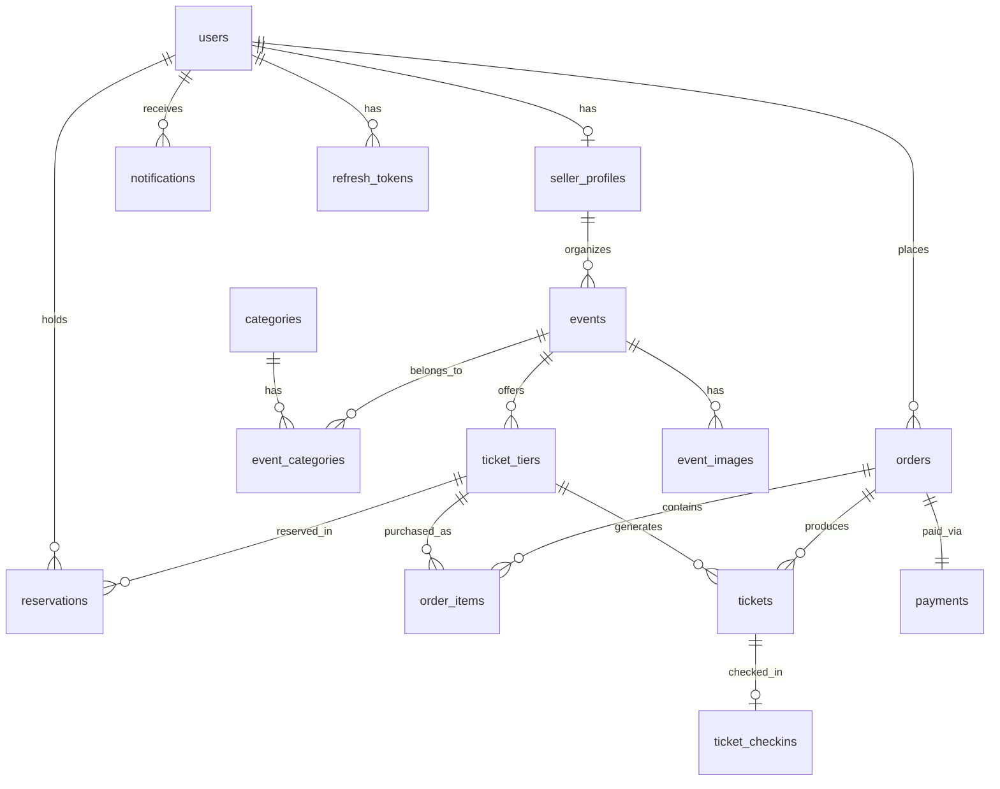
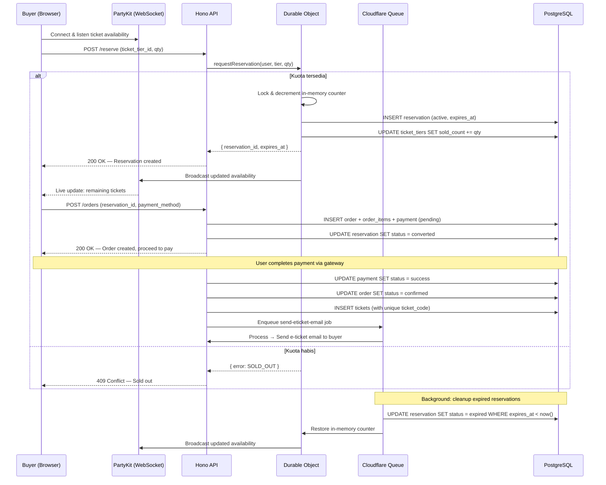

# Jeevatix — Database Design

> Database: **PostgreSQL** | ORM: **Drizzle ORM** | Connection Pooling: **Cloudflare Hyperdrive**

---

## Entity Relationship Diagram

---

## Enum Definitions

Berikut semua enum/type yang digunakan dalam skema. Definisikan sebagai `pgEnum` di Drizzle.

| Enum Name            | Values                                                         | Keterangan                          |
| -------------------- | -------------------------------------------------------------- | ----------------------------------- |
| `user_role`          | `buyer`, `seller`, `admin`                                     | Peran pengguna dalam sistem         |
| `user_status`        | `active`, `suspended`, `banned`                                | Status akun pengguna                |
| `event_status`       | `draft`, `pending_review`, `published`, `rejected`, `ongoing`, `completed`, `cancelled` | Siklus hidup event                  |
| `ticket_tier_status` | `available`, `sold_out`, `hidden`                              | Status tier tiket                   |
| `order_status`       | `pending`, `confirmed`, `expired`, `cancelled`, `refunded`     | Status pesanan                      |
| `payment_status`     | `pending`, `success`, `failed`, `refunded`                     | Status pembayaran                   |
| `payment_method`     | `bank_transfer`, `e_wallet`, `credit_card`, `virtual_account`  | Metode pembayaran                   |
| `reservation_status` | `active`, `converted`, `expired`, `cancelled`                  | Status reservasi tiket sementara    |
| `ticket_status`      | `valid`, `used`, `cancelled`, `refunded`                       | Status tiket individu setelah beli  |
| `notification_type`  | `order_confirmed`, `payment_reminder`, `event_reminder`, `new_order`, `event_approved`, `event_rejected`, `info` | Jenis notifikasi                    |

---

## Tables

### 1. `users`

Tabel utama pengguna. Satu akun bisa berperan sebagai buyer, seller, atau admin.

| Column           | Type                    | Constraint                     | Keterangan                  |
| ---------------- | ----------------------- | ------------------------------ | --------------------------- |
| `id`             | `uuid`                  | PK, default `gen_random_uuid()`| ID unik pengguna            |
| `email`          | `varchar(255)`          | UNIQUE, NOT NULL               | Email login                 |
| `password_hash`  | `varchar(255)`          | NOT NULL                       | Hash bcrypt/argon2          |
| `full_name`      | `varchar(150)`          | NOT NULL                       | Nama lengkap                |
| `phone`          | `varchar(20)`           | NULLABLE                       | Nomor telepon               |
| `avatar_url`     | `text`                  | NULLABLE                       | URL foto profil             |
| `role`           | `user_role`             | NOT NULL, default `buyer`      | Peran pengguna              |
| `status`         | `user_status`           | NOT NULL, default `active`     | Status akun                 |
| `email_verified_at` | `timestamptz`        | NULLABLE                       | Waktu verifikasi email      |
| `created_at`     | `timestamptz`           | NOT NULL, default `now()`      | Waktu dibuat                |
| `updated_at`     | `timestamptz`           | NOT NULL, default `now()`      | Waktu diperbarui            |

**Indexes:** `idx_users_email` (UNIQUE), `idx_users_role`

---

### 2. `seller_profiles`

Profil tambahan khusus user dengan role `seller`. Berisi data organisasi/penyelenggara.

| Column           | Type                    | Constraint                     | Keterangan                      |
| ---------------- | ----------------------- | ------------------------------ | ------------------------------- |
| `id`             | `uuid`                  | PK, default `gen_random_uuid()`| ID profil seller                |
| `user_id`        | `uuid`                  | FK → `users.id`, UNIQUE        | Relasi 1:1 ke users             |
| `org_name`       | `varchar(200)`          | NOT NULL                       | Nama organisasi/penyelenggara   |
| `org_description`| `text`                  | NULLABLE                       | Deskripsi organisasi            |
| `logo_url`       | `text`                  | NULLABLE                       | URL logo organisasi             |
| `bank_name`      | `varchar(100)`          | NULLABLE                       | Nama bank untuk pencairan       |
| `bank_account_number` | `varchar(50)`      | NULLABLE                       | Nomor rekening pencairan        |
| `bank_account_holder` | `varchar(150)`     | NULLABLE                       | Nama pemilik rekening           |
| `is_verified`    | `boolean`               | NOT NULL, default `false`      | Apakah seller sudah diverifikasi|
| `verified_at`    | `timestamptz`           | NULLABLE                       | Waktu verifikasi oleh admin     |
| `verified_by`    | `uuid`                  | FK → `users.id`, NULLABLE      | Admin yang memverifikasi        |
| `created_at`     | `timestamptz`           | NOT NULL, default `now()`      | Waktu dibuat                    |
| `updated_at`     | `timestamptz`           | NOT NULL, default `now()`      | Waktu diperbarui                |

**Indexes:** `idx_seller_profiles_user_id` (UNIQUE)

---

### 3. `categories`

Master data kategori event (Musik, Olahraga, Workshop, dll).

| Column           | Type                    | Constraint                     | Keterangan          |
| ---------------- | ----------------------- | ------------------------------ | ------------------- |
| `id`             | `serial`                | PK                             | ID kategori         |
| `name`           | `varchar(100)`          | UNIQUE, NOT NULL               | Nama kategori       |
| `slug`           | `varchar(100)`          | UNIQUE, NOT NULL               | URL-friendly slug   |
| `icon`           | `varchar(50)`           | NULLABLE                       | Nama ikon (opsional)|
| `created_at`     | `timestamptz`           | NOT NULL, default `now()`      |                     |

---

### 4. `events`

Tabel event/acara yang dijual tiketnya.

| Column           | Type                    | Constraint                     | Keterangan                        |
| ---------------- | ----------------------- | ------------------------------ | --------------------------------- |
| `id`             | `uuid`                  | PK, default `gen_random_uuid()`| ID unik event                     |
| `seller_profile_id` | `uuid`               | FK → `seller_profiles.id`      | Penyelenggara event               |
| `title`          | `varchar(255)`          | NOT NULL                       | Judul event                       |
| `slug`           | `varchar(255)`          | UNIQUE, NOT NULL               | URL-friendly slug                 |
| `description`    | `text`                  | NULLABLE                       | Deskripsi lengkap event (rich text)|
| `venue_name`     | `varchar(255)`          | NOT NULL                       | Nama venue/lokasi                 |
| `venue_address`  | `text`                  | NULLABLE                       | Alamat lengkap venue              |
| `venue_city`     | `varchar(100)`          | NOT NULL                       | Kota                              |
| `venue_latitude` | `numeric(10,7)`         | NULLABLE                       | Koordinat latitude                |
| `venue_longitude`| `numeric(10,7)`         | NULLABLE                       | Koordinat longitude               |
| `start_at`       | `timestamptz`           | NOT NULL                       | Waktu mulai event                 |
| `end_at`         | `timestamptz`           | NOT NULL                       | Waktu selesai event               |
| `sale_start_at`  | `timestamptz`           | NOT NULL                       | Waktu buka penjualan tiket        |
| `sale_end_at`    | `timestamptz`           | NOT NULL                       | Waktu tutup penjualan tiket       |
| `banner_url`     | `text`                  | NULLABLE                       | URL gambar banner utama           |
| `status`         | `event_status`          | NOT NULL, default `draft`      | Status siklus hidup event         |
| `max_tickets_per_order` | `integer`        | NOT NULL, default `5`          | Batas tiket per transaksi         |
| `is_featured`    | `boolean`               | NOT NULL, default `false`      | Ditampilkan di halaman utama      |
| `created_at`     | `timestamptz`           | NOT NULL, default `now()`      |                                   |
| `updated_at`     | `timestamptz`           | NOT NULL, default `now()`      |                                   |

**Indexes:** `idx_events_slug` (UNIQUE), `idx_events_status`, `idx_events_seller_profile_id`, `idx_events_start_at`, `idx_events_sale_start_at`

**Validasi temporal:** Pastikan `end_at > start_at`, `sale_end_at > sale_start_at`, dan `sale_start_at <= start_at`. Validasi ini diterapkan di Zod schema pada API layer.

---

### 5. `event_categories`

Tabel pivot many-to-many antara event dan kategori.

| Column        | Type     | Constraint                  | Keterangan   |
| ------------- | -------- | --------------------------- | ------------ |
| `event_id`    | `uuid`   | FK → `events.id`, NOT NULL  | ID event     |
| `category_id` | `serial` | FK → `categories.id`, NOT NULL | ID kategori |

**Primary Key:** (`event_id`, `category_id`)

---

### 6. `event_images`

Galeri gambar tambahan untuk event.

| Column       | Type                    | Constraint                     | Keterangan               |
| ------------ | ----------------------- | ------------------------------ | ------------------------ |
| `id`         | `uuid`                  | PK, default `gen_random_uuid()`| ID gambar                |
| `event_id`   | `uuid`                  | FK → `events.id`, NOT NULL     | Relasi ke event          |
| `image_url`  | `text`                  | NOT NULL                       | URL gambar               |
| `sort_order` | `integer`               | NOT NULL, default `0`          | Urutan tampilan          |
| `created_at` | `timestamptz`           | NOT NULL, default `now()`      |                          |

**Indexes:** `idx_event_images_event_id`

---

### 7. `ticket_tiers`

Tier/jenis tiket dalam satu event (contoh: VIP, Regular, Early Bird). Kolom `quota` dan `sold_count` menjadi *source of truth* stok di database, sementara Durable Objects menangani lock saat *war ticket*.

| Column        | Type                    | Constraint                     | Keterangan                              |
| ------------- | ----------------------- | ------------------------------ | --------------------------------------- |
| `id`          | `uuid`                  | PK, default `gen_random_uuid()`| ID tier tiket                           |
| `event_id`    | `uuid`                  | FK → `events.id`, NOT NULL     | Event pemilik tier ini                  |
| `name`        | `varchar(100)`          | NOT NULL                       | Nama tier (VIP, Reguler, dll)           |
| `description` | `text`                  | NULLABLE                       | Deskripsi benefit tier                  |
| `price`       | `numeric(12,2)`         | NOT NULL                       | Harga per tiket (IDR)                   |
| `quota`       | `integer`               | NOT NULL                       | Total kuota tiket tier ini              |
| `sold_count`  | `integer`               | NOT NULL, default `0`          | Jumlah tiket terjual (di-update atomik) |
| `sort_order`  | `integer`               | NOT NULL, default `0`          | Urutan tampilan                         |
| `status`      | `ticket_tier_status`    | NOT NULL, default `available`  | Status tier                             |
| `sale_start_at`| `timestamptz`          | NULLABLE                       | Override waktu buka jual tier (opsional)|
| `sale_end_at` | `timestamptz`           | NULLABLE                       | Override waktu tutup jual tier (opsional)|
| `created_at`  | `timestamptz`           | NOT NULL, default `now()`      |                                         |
| `updated_at`  | `timestamptz`           | NOT NULL, default `now()`      |                                         |

**Indexes:** `idx_ticket_tiers_event_id`, `idx_ticket_tiers_status`

**Catatan penting:** Field `sold_count` di-update secara atomik menggunakan `SET sold_count = sold_count + N` setelah Durable Object memberikan lock. Jangan pernah ambil nilai → tambah di aplikasi → simpan kembali (race condition).

**CHECK constraint:** Tambahkan `CHECK (sold_count >= 0 AND sold_count <= quota)` sebagai safety net di level database, meskipun Durable Object sudah menangani concurrency.

---

### 8. `reservations`

Reservasi sementara yang dibuat oleh Durable Objects saat user berhasil mendapat slot di *war ticket*. Berlaku selama durasi tertentu (misal 10 menit) untuk memberi waktu pembayaran.

| Column          | Type                    | Constraint                     | Keterangan                            |
| --------------- | ----------------------- | ------------------------------ | ------------------------------------- |
| `id`            | `uuid`                  | PK, default `gen_random_uuid()`| ID reservasi                          |
| `user_id`       | `uuid`                  | FK → `users.id`, NOT NULL      | User yang mereservasi                 |
| `ticket_tier_id`| `uuid`                  | FK → `ticket_tiers.id`, NOT NULL| Tier tiket yang direservasi          |
| `quantity`      | `integer`               | NOT NULL                       | Jumlah tiket yang direservasi         |
| `status`        | `reservation_status`    | NOT NULL, default `active`     | Status reservasi                      |
| `expires_at`    | `timestamptz`           | NOT NULL                       | Batas waktu reservasi (TTL)           |
| `created_at`    | `timestamptz`           | NOT NULL, default `now()`      |                                       |

**Indexes:** `idx_reservations_user_id`, `idx_reservations_ticket_tier_id`, `idx_reservations_status_expires` (`status`, `expires_at`) — untuk query pembersihan reservasi kadaluarsa.

**Alur:**
1. Durable Object menerima request → cek kuota → buat reservasi `active` → kurangi kuota sementara.
2. Jika user bayar sebelum `expires_at` → status berubah ke `converted`, order dibuat.
3. Jika `expires_at` terlewati dan belum bayar → Cloudflare Queue trigger → status jadi `expired`, kuota dikembalikan.

---

### 9. `orders`

Pesanan yang dibuat ketika user melanjutkan pembayaran dari reservasi.

| Column           | Type                    | Constraint                     | Keterangan                    |
| ---------------- | ----------------------- | ------------------------------ | ----------------------------- |
| `id`             | `uuid`                  | PK, default `gen_random_uuid()`| ID pesanan                    |
| `user_id`        | `uuid`                  | FK → `users.id`, NOT NULL      | Pembeli                       |
| `reservation_id` | `uuid`                  | FK → `reservations.id`, NULLABLE, UNIQUE | Reservasi asal (opsional) |
| `order_number`   | `varchar(30)`           | UNIQUE, NOT NULL               | Nomor pesanan tampil (JVX-xxx)|
| `total_amount`   | `numeric(14,2)`         | NOT NULL                       | Total harga (IDR)             |
| `service_fee`    | `numeric(12,2)`         | NOT NULL, default `0`          | Biaya layanan platform        |
| `status`         | `order_status`          | NOT NULL, default `pending`    | Status pesanan                |
| `expires_at`     | `timestamptz`           | NOT NULL                       | Batas waktu pembayaran        |
| `confirmed_at`   | `timestamptz`           | NULLABLE                       | Waktu dikonfirmasi            |
| `created_at`     | `timestamptz`           | NOT NULL, default `now()`      |                               |
| `updated_at`     | `timestamptz`           | NOT NULL, default `now()`      |                               |

**Indexes:** `idx_orders_user_id`, `idx_orders_order_number` (UNIQUE), `idx_orders_status`, `idx_orders_reservation_id` (UNIQUE)

---

### 10. `order_items`

Detail item per pesanan. Satu order bisa berisi beberapa tier tiket.

| Column          | Type                    | Constraint                     | Keterangan                   |
| --------------- | ----------------------- | ------------------------------ | ---------------------------- |
| `id`            | `uuid`                  | PK, default `gen_random_uuid()`| ID item                      |
| `order_id`      | `uuid`                  | FK → `orders.id`, NOT NULL     | Relasi ke order              |
| `ticket_tier_id`| `uuid`                  | FK → `ticket_tiers.id`, NOT NULL| Tier tiket yang dibeli      |
| `quantity`      | `integer`               | NOT NULL                       | Jumlah tiket                 |
| `unit_price`    | `numeric(12,2)`         | NOT NULL                       | Harga satuan saat pembelian  |
| `subtotal`      | `numeric(14,2)`         | NOT NULL                       | quantity × unit_price        |

**Indexes:** `idx_order_items_order_id`, `idx_order_items_ticket_tier_id`

---

### 11. `payments`

Catatan pembayaran untuk setiap order. Relasi 1:1 dengan orders.

| Column             | Type                    | Constraint                     | Keterangan                         |
| ------------------ | ----------------------- | ------------------------------ | ---------------------------------- |
| `id`               | `uuid`                  | PK, default `gen_random_uuid()`| ID pembayaran                      |
| `order_id`         | `uuid`                  | FK → `orders.id`, UNIQUE       | Relasi 1:1 ke order               |
| `method`           | `payment_method`        | NOT NULL                       | Metode pembayaran                  |
| `status`           | `payment_status`        | NOT NULL, default `pending`    | Status pembayaran                  |
| `amount`           | `numeric(14,2)`         | NOT NULL                       | Jumlah yang dibayar                |
| `external_ref`     | `varchar(255)`          | NULLABLE                       | Referensi dari payment gateway     |
| `paid_at`          | `timestamptz`           | NULLABLE                       | Waktu pembayaran berhasil          |
| `created_at`       | `timestamptz`           | NOT NULL, default `now()`      |                                    |
| `updated_at`       | `timestamptz`           | NOT NULL, default `now()`      |                                    |

**Indexes:** `idx_payments_order_id` (UNIQUE), `idx_payments_status`, `idx_payments_external_ref`

---

### 12. `tickets`

Tiket individu yang diterbitkan setelah order dikonfirmasi. Setiap tiket memiliki kode unik untuk masuk venue (QR code).

| Column          | Type                    | Constraint                     | Keterangan                          |
| --------------- | ----------------------- | ------------------------------ | ----------------------------------- |
| `id`            | `uuid`                  | PK, default `gen_random_uuid()`| ID tiket                            |
| `order_id`      | `uuid`                  | FK → `orders.id`, NOT NULL     | Order asal                          |
| `ticket_tier_id`| `uuid`                  | FK → `ticket_tiers.id`, NOT NULL| Tier tiket                         |
| `ticket_code`   | `varchar(50)`           | UNIQUE, NOT NULL               | Kode unik tiket (untuk QR)         |
| `attendee_name` | `varchar(150)`          | NULLABLE                       | Nama peserta (opsional)             |
| `attendee_email`| `varchar(255)`          | NULLABLE                       | Email peserta (opsional)            |
| `status`        | `ticket_status`         | NOT NULL, default `valid`      | Status tiket                        |
| `issued_at`     | `timestamptz`           | NOT NULL, default `now()`      | Waktu diterbitkan                   |
| `created_at`    | `timestamptz`           | NOT NULL, default `now()`      |                                     |

**Indexes:** `idx_tickets_order_id`, `idx_tickets_ticket_code` (UNIQUE), `idx_tickets_ticket_tier_id`, `idx_tickets_status`

---

### 13. `ticket_checkins`

Log check-in tiket di venue. Relasi 1:1 dengan tickets.

| Column          | Type                    | Constraint                     | Keterangan                    |
| --------------- | ----------------------- | ------------------------------ | ----------------------------- |
| `id`            | `uuid`                  | PK, default `gen_random_uuid()`| ID check-in                   |
| `ticket_id`     | `uuid`                  | FK → `tickets.id`, UNIQUE      | Tiket yang di-check-in        |
| `checked_in_at` | `timestamptz`           | NOT NULL, default `now()`      | Waktu check-in                |
| `checked_in_by` | `uuid`                  | FK → `users.id`, NULLABLE      | Admin/staff yang memverifikasi|

**Indexes:** `idx_ticket_checkins_ticket_id` (UNIQUE)

---

### 14. `notifications`

Notifikasi yang dikirim ke user (konfirmasi order, pengingat event, dll). Di-enqueue via Cloudflare Queues.

| Column       | Type                    | Constraint                     | Keterangan                   |
| ------------ | ----------------------- | ------------------------------ | ---------------------------- |
| `id`         | `uuid`                  | PK, default `gen_random_uuid()`| ID notifikasi                |
| `user_id`    | `uuid`                  | FK → `users.id`, NOT NULL      | Penerima notifikasi          |
| `type`       | `notification_type`     | NOT NULL                       | Jenis notifikasi             |
| `title`      | `varchar(255)`          | NOT NULL                       | Judul notifikasi             |
| `body`       | `text`                  | NOT NULL                       | Isi notifikasi               |
| `is_read`    | `boolean`               | NOT NULL, default `false`      | Sudah dibaca?                |
| `metadata`   | `jsonb`                 | NULLABLE                       | Data tambahan (event_id, dll)|
| `created_at` | `timestamptz`           | NOT NULL, default `now()`      |                              |

**Indexes:** `idx_notifications_user_id_is_read` (`user_id`, `is_read`)

---

### 15. `refresh_tokens`

Tabel untuk menyimpan refresh token JWT. Digunakan untuk memperbarui access token tanpa login ulang.

| Column       | Type                    | Constraint                     | Keterangan                     |
| ------------ | ----------------------- | ------------------------------ | ------------------------------ |
| `id`         | `uuid`                  | PK, default `gen_random_uuid()`| ID token                       |
| `user_id`    | `uuid`                  | FK → `users.id`, NOT NULL      | Pemilik token                  |
| `token_hash` | `varchar(255)`          | UNIQUE, NOT NULL               | Hash dari refresh token        |
| `expires_at` | `timestamptz`           | NOT NULL                       | Waktu kedaluwarsa token        |
| `revoked_at` | `timestamptz`           | NULLABLE                       | Waktu token dicabut (jika ada) |
| `created_at` | `timestamptz`           | NOT NULL, default `now()`      |                                |

**Indexes:** `idx_refresh_tokens_user_id`, `idx_refresh_tokens_token_hash` (UNIQUE), `idx_refresh_tokens_expires_at`

---

## Concurrency & War Ticket Flow

Diagram alur saat terjadi *war ticket* (lonjakan request bersamaan):

---

## Key Design Decisions

| Keputusan | Alasan |
|---|---|
| UUID sebagai primary key | Aman untuk distributed system, tidak mudah ditebak, cocok untuk edge computing |
| `sold_count` di `ticket_tiers` | Source of truth stok di DB, di-sync dari Durable Object secara atomik |
| Tabel `reservations` terpisah | Memisahkan konsep "hold sementara" dari "pembelian final", memudahkan TTL cleanup |
| `order_number` human-readable | Untuk ditampilkan di UI dan komunikasi CS, berbeda dengan UUID internal |
| `unit_price` di `order_items` | Menyimpan harga saat transaksi (snapshot), karena harga bisa berubah di masa depan |
| `jsonb metadata` di notifications | Fleksibel untuk menyimpan context data tanpa alter table |
| `timestamptz` untuk semua waktu | Penting untuk sistem multi-timezone, selalu simpan dalam UTC |
| Separate `ticket_checkins` | Audit trail check-in terpisah, tidak mencampur data tiket dengan data operasional venue |
| `refresh_tokens` terpisah | Memungkinkan token rotation dan revocation tanpa invalidate semua sesi user |
| `verified_at` + `verified_by` di seller_profiles | Audit trail verifikasi seller: kapan dan oleh siapa |
| `pending_review` + `rejected` di event_status | Memberi visibilitas seller atas status review event oleh admin |
| CHECK constraint `sold_count <= quota` | Safety net di level database sebagai perlindungan tambahan di luar Durable Object |

---

## Notes for AI Agents

- **Drizzle ORM schema** harus didefinisikan di `packages/core/` sesuai monorepo structure. Total ada **15 tabel** dan **10 enum**.
- Semua tabel menggunakan **snake_case** naming convention.
- Semua foreign key harus memiliki **ON DELETE** behavior yang eksplisit:
  - `users` deletion → soft delete (jangan cascade, gunakan `status = banned`).
  - `events` deletion → cascade ke `ticket_tiers`, `event_categories`, `event_images`.
  - `orders` deletion → **JANGAN** hapus, gunakan status `cancelled`/`refunded`.
- **Migrasi** menggunakan `drizzle-kit` (`push` untuk dev, `migrate` untuk production).
- Field `sold_count` pada `ticket_tiers` **hanya boleh diupdate** melalui SQL atomik atau Durable Object sync, **bukan** dari application-level read-modify-write.
- Semua `created_at` dan `updated_at` menggunakan `$defaultFn(() => new Date())` di Drizzle, bukan database trigger.
- **File upload** menggunakan **Cloudflare R2** sebagai object storage. Endpoint upload mengembalikan URL publik R2.
- **Email service** menggunakan provider transactional email (Resend/Mailgun), diintegrasikan via Cloudflare Queue untuk pengiriman async.

### MCP Tools

- **filesystem MCP**: Gunakan untuk membaca file schema (`read_file`), navigasi folder `packages/core/src/db/schema/` (`list_directory`), dan menulis file migrasi/schema (`write_file`).
- **shadcn-ui MCP**: Tidak relevan untuk database design.
