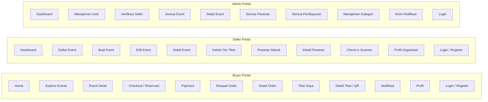

# Jeevatix — Daftar Halaman & Menu

> Dokumen ini mendefinisikan seluruh halaman yang harus dibangun di 3 portal frontend dan 1 backend API.
> Setiap halaman mencantumkan **route**, **tabel database** yang terlibat, dan **deskripsi singkat** fungsinya.

---

## Portal Overview

| Portal   | App       | Framework  | Base URL                  | Target User          |
| -------- | --------- | ---------- | ------------------------- | -------------------- |
| Buyer    | `apps/buyer`  | Astro      | `http://localhost:4301` | Pembeli tiket        |
| Admin    | `apps/admin`  | SvelteKit  | `http://localhost:4302` | Administrator Jeevatix |
| Seller   | `apps/seller` | SvelteKit  | `http://localhost:4303` | Penyelenggara event  |
| API      | `apps/api`    | Hono       | `http://localhost:8787` | Semua portal (backend) |

---

## Sitemap Diagram

---

## A. Buyer Portal (`apps/buyer` — Astro)

### Auth Pages (Publik, tanpa login)

| #  | Halaman            | Route                | Tabel Terlibat          | Deskripsi                                              |
| -- | ------------------ | -------------------- | ----------------------- | ------------------------------------------------------ |
| B1 | Register           | `/register`          | `users`                 | Form pendaftaran akun buyer baru (email, password, nama, phone) |
| B2 | Login              | `/login`             | `users`                 | Form login dengan email & password                     |
| B3 | Lupa Password      | `/forgot-password`   | `users`                 | Form kirim email reset password                        |
| B4 | Reset Password     | `/reset-password`    | `users`                 | Form input password baru dari link email                |
| B5 | Verifikasi Email   | `/verify-email`      | `users`                 | Halaman konfirmasi verifikasi email (update `email_verified_at`) |

### Public Pages (Tanpa login)

| #   | Halaman           | Route                  | Tabel Terlibat                                                       | Deskripsi                                                                |
| --- | ----------------- | ---------------------- | -------------------------------------------------------------------- | ------------------------------------------------------------------------ |
| B6  | Homepage          | `/`                    | `events`, `categories`, `event_images`, `ticket_tiers`               | Landing page: banner hero, event featured, event upcoming, kategori      |
| B7  | Explore / Search  | `/events`              | `events`, `categories`, `event_categories`, `ticket_tiers`           | Daftar event dengan filter (kategori, kota, tanggal, harga) & search     |
| B8  | Event Detail      | `/events/[slug]`       | `events`, `event_images`, `event_categories`, `categories`, `ticket_tiers`, `seller_profiles` | Detail event: deskripsi, galeri, lokasi (map), tier tiket & harga, info penyelenggara. WebSocket (PartyKit) untuk live availability |
| B9  | Halaman Kategori  | `/categories/[slug]`   | `categories`, `events`, `event_categories`, `ticket_tiers`           | Daftar event berdasarkan kategori tertentu                               |

### Protected Pages (Perlu login sebagai buyer)

| #   | Halaman            | Route                    | Tabel Terlibat                                                            | Deskripsi                                                                     |
| --- | ------------------ | ------------------------ | ------------------------------------------------------------------------- | ----------------------------------------------------------------------------- |
| B10 | Checkout           | `/checkout/[event-slug]` | `events`, `ticket_tiers`, `reservations`, `users`                         | Pilih tier & jumlah tiket → hit Durable Object untuk reservasi → countdown timer. WebSocket PartyKit untuk live stock |
| B11 | Payment            | `/payment/[order-id]`    | `orders`, `order_items`, `payments`, `ticket_tiers`, `reservations`       | Ringkasan order, pilih metode bayar, proses pembayaran, countdown batas waktu |
| B12 | Riwayat Order      | `/orders`                | `orders`, `order_items`, `payments`, `ticket_tiers`, `events`             | Daftar semua pesanan user (pending, confirmed, expired, cancelled, refunded)  |
| B13 | Detail Order       | `/orders/[order-id]`     | `orders`, `order_items`, `payments`, `ticket_tiers`, `events`, `tickets`  | Detail lengkap satu pesanan: item, status, payment info, link ke tiket        |
| B14 | Tiket Saya         | `/tickets`               | `tickets`, `ticket_tiers`, `events`, `orders`                             | Daftar semua tiket aktif milik user (upcoming events)                         |
| B15 | Detail Tiket       | `/tickets/[ticket-id]`   | `tickets`, `ticket_tiers`, `events`, `ticket_checkins`                    | Detail tiket + QR code (`ticket_code`), status check-in                       |
| B16 | Notifikasi         | `/notifications`         | `notifications`                                                           | Daftar notifikasi (konfirmasi order, pengingat event, info). Mark as read     |
| B17 | Profil Saya        | `/profile`               | `users`                                                                   | Lihat & edit profil: nama, email, phone, avatar, ubah password                |

**Total halaman Buyer Portal: 17**

---

## B. Seller Portal (`apps/seller` — SvelteKit)

### Auth Pages

| #  | Halaman            | Route                | Tabel Terlibat                  | Deskripsi                                                  |
| -- | ------------------ | -------------------- | ------------------------------- | ---------------------------------------------------------- |
| S1 | Register Seller    | `/register`          | `users`, `seller_profiles`      | Pendaftaran akun seller + data organisasi (org_name, dll)  |
| S2 | Login              | `/login`             | `users`                         | Login seller                                               |
| S3 | Lupa Password      | `/forgot-password`   | `users`                         | Kirim email reset password                                 |
| S4 | Reset Password     | `/reset-password`    | `users`                         | Input password baru                                        |

### Dashboard & Event Management

| #   | Halaman               | Route                           | Tabel Terlibat                                                              | Deskripsi                                                                      |
| --- | --------------------- | ------------------------------- | --------------------------------------------------------------------------- | ------------------------------------------------------------------------------ |
| S5  | Dashboard             | `/`                             | `events`, `orders`, `order_items`, `payments`, `ticket_tiers`, `seller_profiles` | Ringkasan: total event, total revenue, total tiket terjual, event upcoming, pesanan terbaru. Grafik penjualan |
| S6  | Daftar Event          | `/events`                       | `events`, `ticket_tiers`, `seller_profiles`                                 | Tabel semua event milik seller (filter by status: draft/published/completed)   |
| S7  | Buat Event Baru       | `/events/create`                | `events`, `event_categories`, `event_images`, `categories`, `ticket_tiers`  | Form multi-step: info dasar → lokasi → gambar → tier tiket → review & publish  |
| S8  | Edit Event            | `/events/[event-id]/edit`       | `events`, `event_categories`, `event_images`, `categories`, `ticket_tiers`  | Edit detail event yang sudah ada (semua field)                                 |
| S9  | Detail Event          | `/events/[event-id]`            | `events`, `event_images`, `event_categories`, `categories`, `ticket_tiers`, `orders`, `order_items` | Overview event: statistik penjualan per tier, grafik, daftar pesanan           |
| S10 | Kelola Tier Tiket     | `/events/[event-id]/tiers`      | `ticket_tiers`, `events`                                                    | CRUD tier tiket (nama, harga, kuota, status, urutan). Tampilkan sold_count     |

### Order & Ticket Management

| #   | Halaman              | Route                            | Tabel Terlibat                                                   | Deskripsi                                                            |
| --- | -------------------- | -------------------------------- | ---------------------------------------------------------------- | -------------------------------------------------------------------- |
| S11 | Pesanan Masuk        | `/orders`                        | `orders`, `order_items`, `payments`, `users`, `events`, `ticket_tiers` | Daftar pesanan untuk semua event milik seller (filter by event, status) |
| S12 | Detail Pesanan       | `/orders/[order-id]`             | `orders`, `order_items`, `payments`, `users`, `tickets`, `ticket_tiers`, `events` | Detail pesanan: data pembeli, item, status bayar, tiket yang diterbitkan |
| S13 | Check-in Scanner     | `/events/[event-id]/checkin`     | `tickets`, `ticket_checkins`, `ticket_tiers`, `events`, `users`  | Scan QR code tiket → validasi `ticket_code` → catat check-in. Tampilkan statistik check-in live |

### Profile & Settings

| #   | Halaman              | Route                | Tabel Terlibat                  | Deskripsi                                                          |
| --- | -------------------- | -------------------- | ------------------------------- | ------------------------------------------------------------------ |
| S14 | Profil Organisasi    | `/profile`           | `users`, `seller_profiles`      | Edit profil organisasi: nama, deskripsi, logo, data bank pencairan |
| S15 | Ubah Password        | `/profile/password`  | `users`                         | Form ubah password akun                                            |

### Notifications

| #   | Halaman              | Route                | Tabel Terlibat                  | Deskripsi                                                          |
| --- | -------------------- | -------------------- | ------------------------------- | ------------------------------------------------------------------ |
| S16 | Notifikasi           | `/notifications`     | `notifications`                 | Daftar notifikasi seller (pesanan baru, event approved/rejected). Mark as read |

**Total halaman Seller Portal: 16**

---

## C. Admin Portal (`apps/admin` — SvelteKit)

### Auth Pages

| #  | Halaman    | Route      | Tabel Terlibat | Deskripsi         |
| -- | ---------- | ---------- | -------------- | ----------------- |
| A1 | Login      | `/login`   | `users`        | Login admin       |

### Dashboard

| #  | Halaman    | Route | Tabel Terlibat                                                                 | Deskripsi                                                                           |
| -- | ---------- | ----- | ------------------------------------------------------------------------------ | ----------------------------------------------------------------------------------- |
| A2 | Dashboard  | `/`   | `users`, `events`, `orders`, `payments`, `tickets`, `seller_profiles`          | Ringkasan platform: total user, total event, total revenue, grafik transaksi harian |

### User Management

| #  | Halaman        | Route              | Tabel Terlibat                  | Deskripsi                                                               |
| -- | -------------- | ------------------ | ------------------------------- | ----------------------------------------------------------------------- |
| A3 | Daftar User    | `/users`           | `users`                         | Tabel semua user (filter by role, status). Search by nama/email         |
| A4 | Detail User    | `/users/[user-id]` | `users`, `seller_profiles`, `orders`, `tickets`, `notifications` | Detail profil user, riwayat order, tiket, aksi: suspend/ban/activate    |

### Seller Verification

| #  | Halaman              | Route                     | Tabel Terlibat                  | Deskripsi                                                              |
| -- | -------------------- | ------------------------- | ------------------------------- | ---------------------------------------------------------------------- |
| A5 | Daftar Seller        | `/sellers`                | `users`, `seller_profiles`      | Daftar semua seller + status verifikasi. Filter: verified/unverified   |
| A6 | Detail & Verifikasi  | `/sellers/[seller-id]`    | `users`, `seller_profiles`, `events` | Review data organisasi seller → approve (set `is_verified = true`) atau tolak |

### Event Management

| #  | Halaman        | Route                    | Tabel Terlibat                                                                    | Deskripsi                                                          |
| -- | -------------- | ------------------------ | --------------------------------------------------------------------------------- | ------------------------------------------------------------------ |
| A7 | Semua Event    | `/events`                | `events`, `seller_profiles`, `categories`, `event_categories`, `ticket_tiers`     | Tabel semua event di platform (filter by status, kategori, seller) |
| A8 | Detail Event   | `/events/[event-id]`     | `events`, `event_images`, `event_categories`, `categories`, `ticket_tiers`, `seller_profiles`, `orders`, `order_items` | Detail event + statistik. Aksi admin: ubah status (publish/cancel)  |

### Order & Payment Management

| #   | Halaman           | Route                     | Tabel Terlibat                                                              | Deskripsi                                                                  |
| --- | ----------------- | ------------------------- | --------------------------------------------------------------------------- | -------------------------------------------------------------------------- |
| A9  | Semua Pesanan     | `/orders`                 | `orders`, `order_items`, `payments`, `users`, `events`, `ticket_tiers`      | Daftar seluruh pesanan di platform (filter by status, event, tanggal)      |
| A10 | Detail Pesanan    | `/orders/[order-id]`      | `orders`, `order_items`, `payments`, `users`, `tickets`, `ticket_tiers`, `events` | Detail pesanan. Aksi admin: konfirmasi manual, refund, cancel              |
| A11 | Semua Pembayaran  | `/payments`               | `payments`, `orders`, `users`                                               | Daftar semua pembayaran (filter by status, method, tanggal). Reconciliation |
| A12 | Detail Pembayaran | `/payments/[payment-id]`  | `payments`, `orders`, `order_items`, `users`, `events`                      | Detail pembayaran + order terkait. Aksi: update status manual jika perlu   |

### Category Management

| #   | Halaman            | Route          | Tabel Terlibat                   | Deskripsi                                                  |
| --- | ------------------ | -------------- | -------------------------------- | ---------------------------------------------------------- |
| A13 | Manajemen Kategori | `/categories`  | `categories`, `event_categories` | CRUD kategori event (nama, slug, icon). Tampilkan jumlah event per kategori |

### Notification Management

| #   | Halaman              | Route            | Tabel Terlibat         | Deskripsi                                                            |
| --- | -------------------- | ---------------- | ---------------------- | -------------------------------------------------------------------- |
| A14 | Daftar Notifikasi    | `/notifications` | `notifications`, `users` | Daftar notifikasi terkirim + form kirim notifikasi broadcast ke user |

### Reservation Monitoring

| #   | Halaman              | Route           | Tabel Terlibat                              | Deskripsi                                                          |
| --- | -------------------- | --------------- | ------------------------------------------- | ------------------------------------------------------------------ |
| A15 | Monitor Reservasi    | `/reservations` | `reservations`, `users`, `ticket_tiers`, `events` | Monitoring reservasi aktif/expired real-time. Berguna saat war ticket berlangsung |

**Total halaman Admin Portal: 15**

---

## D. API Endpoints (`apps/api` — Hono)

### Auth API

| #   | Method | Endpoint                  | Tabel Terlibat             | Deskripsi                          | Akses         |
| --- | ------ | ------------------------- | -------------------------- | ---------------------------------- | ------------- |
| E1  | POST   | `/auth/register`          | `users`                    | Registrasi buyer baru              | Public        |
| E2  | POST   | `/auth/register/seller`   | `users`, `seller_profiles` | Registrasi seller baru             | Public        |
| E3  | POST   | `/auth/login`             | `users`                    | Login → return JWT/session         | Public        |
| E4  | POST   | `/auth/forgot-password`   | `users`                    | Kirim email reset password         | Public        |
| E5  | POST   | `/auth/reset-password`    | `users`                    | Reset password dengan token        | Public        |
| E6  | POST   | `/auth/verify-email`      | `users`                    | Verifikasi email                   | Public        |
| E7  | POST   | `/auth/logout`            | —                          | Logout / invalidate session        | Authenticated |
| E63 | POST   | `/auth/refresh`           | `refresh_tokens`           | Refresh access token via refresh token | Public        |

### User API

| #   | Method | Endpoint                  | Tabel Terlibat             | Deskripsi                       | Akses         |
| --- | ------ | ------------------------- | -------------------------- | ------------------------------- | ------------- |
| E8  | GET    | `/users/me`               | `users`                    | Get current user profile        | Authenticated |
| E9  | PATCH  | `/users/me`               | `users`                    | Update profil (nama, phone, avatar) | Authenticated |
| E10 | PATCH  | `/users/me/password`      | `users`                    | Ubah password                   | Authenticated |

### File Upload API

| #   | Method | Endpoint                  | Tabel Terlibat             | Deskripsi                                     | Akses         |
| --- | ------ | ------------------------- | -------------------------- | --------------------------------------------- | ------------- |
| E64 | POST   | `/upload`                 | — (Cloudflare R2)          | Upload file (image) ke R2, return URL publik  | Authenticated |

### Event API (Public)

| #   | Method | Endpoint                       | Tabel Terlibat                                                         | Deskripsi                        | Akses  |
| --- | ------ | ------------------------------ | ---------------------------------------------------------------------- | -------------------------------- | ------ |
| E11 | GET    | `/events`                      | `events`, `categories`, `event_categories`, `ticket_tiers`             | List events (search, filter, paginate) | Public |
| E12 | GET    | `/events/featured`             | `events`, `event_images`, `ticket_tiers`                               | Event yang di-feature            | Public |
| E13 | GET    | `/events/:slug`                | `events`, `event_images`, `event_categories`, `categories`, `ticket_tiers`, `seller_profiles` | Detail event by slug             | Public |
| E14 | GET    | `/categories`                  | `categories`                                                           | List semua kategori              | Public |
| E15 | GET    | `/categories/:slug/events`     | `categories`, `event_categories`, `events`, `ticket_tiers`             | Events by kategori               | Public |

### Event API (Seller)

| #   | Method | Endpoint                           | Tabel Terlibat                                                         | Deskripsi                          | Akses   |
| --- | ------ | ---------------------------------- | ---------------------------------------------------------------------- | ---------------------------------- | ------- |
| E16 | GET    | `/seller/events`                   | `events`, `ticket_tiers`, `seller_profiles`                            | List event milik seller            | Seller  |
| E17 | POST   | `/seller/events`                   | `events`, `event_categories`, `event_images`, `ticket_tiers`           | Buat event baru                    | Seller  |
| E18 | GET    | `/seller/events/:id`               | `events`, `event_images`, `event_categories`, `ticket_tiers`, `orders`, `order_items` | Detail event seller         | Seller  |
| E19 | PATCH  | `/seller/events/:id`               | `events`, `event_categories`, `event_images`                           | Update event                       | Seller  |
| E20 | DELETE | `/seller/events/:id`               | `events`, `event_categories`, `event_images`, `ticket_tiers`           | Hapus event (hanya draft)          | Seller  |

### Ticket Tier API (Seller)

| #   | Method | Endpoint                                    | Tabel Terlibat       | Deskripsi                   | Akses  |
| --- | ------ | ------------------------------------------- | -------------------- | --------------------------- | ------ |
| E21 | GET    | `/seller/events/:id/tiers`                  | `ticket_tiers`       | List tier tiket event       | Seller |
| E22 | POST   | `/seller/events/:id/tiers`                  | `ticket_tiers`       | Tambah tier tiket baru      | Seller |
| E23 | PATCH  | `/seller/events/:id/tiers/:tierId`          | `ticket_tiers`       | Update tier tiket           | Seller |
| E24 | DELETE | `/seller/events/:id/tiers/:tierId`          | `ticket_tiers`       | Hapus tier (jika belum ada penjualan) | Seller |

### Reservation & Checkout API (Buyer)

| #   | Method | Endpoint                       | Tabel Terlibat                                              | Deskripsi                                                 | Akses  |
| --- | ------ | ------------------------------ | ----------------------------------------------------------- | --------------------------------------------------------- | ------ |
| E25 | POST   | `/reservations`                | `reservations`, `ticket_tiers` + Durable Object             | Buat reservasi tiket (via Durable Object lock)            | Buyer  |
| E26 | GET    | `/reservations/:id`            | `reservations`, `ticket_tiers`, `events`                     | Cek status reservasi aktif                                | Buyer  |
| E27 | DELETE | `/reservations/:id`            | `reservations`, `ticket_tiers` + Durable Object             | Batalkan reservasi (kembalikan kuota)                     | Buyer  |

### Order API (Buyer)

| #   | Method | Endpoint                       | Tabel Terlibat                                                          | Deskripsi                        | Akses  |
| --- | ------ | ------------------------------ | ----------------------------------------------------------------------- | -------------------------------- | ------ |
| E28 | POST   | `/orders`                      | `orders`, `order_items`, `payments`, `reservations`, `ticket_tiers`     | Buat order dari reservasi        | Buyer  |
| E29 | GET    | `/orders`                      | `orders`, `order_items`, `payments`, `ticket_tiers`, `events`           | List order milik buyer           | Buyer  |
| E30 | GET    | `/orders/:id`                  | `orders`, `order_items`, `payments`, `tickets`, `ticket_tiers`, `events`| Detail order                     | Buyer  |

### Payment API

| #   | Method | Endpoint                       | Tabel Terlibat                                                  | Deskripsi                                | Akses        |
| --- | ------ | ------------------------------ | --------------------------------------------------------------- | ---------------------------------------- | ------------ |
| E31 | POST   | `/payments/:orderId/pay`       | `payments`, `orders`                                            | Inisiasi pembayaran (redirect ke gateway)| Buyer        |
| E32 | POST   | `/webhooks/payment`            | `payments`, `orders`, `tickets`, `order_items`, `ticket_tiers`  | Webhook dari payment gateway (callback)  | Payment Gateway |

### Ticket API

| #   | Method | Endpoint                       | Tabel Terlibat                                          | Deskripsi                       | Akses  |
| --- | ------ | ------------------------------ | ------------------------------------------------------- | ------------------------------- | ------ |
| E33 | GET    | `/tickets`                     | `tickets`, `ticket_tiers`, `events`, `orders`           | List tiket milik buyer          | Buyer  |
| E34 | GET    | `/tickets/:id`                 | `tickets`, `ticket_tiers`, `events`, `ticket_checkins`  | Detail tiket + QR data          | Buyer  |

### Check-in API (Seller)

| #   | Method | Endpoint                           | Tabel Terlibat                                             | Deskripsi                          | Akses  |
| --- | ------ | ---------------------------------- | ---------------------------------------------------------- | ---------------------------------- | ------ |
| E35 | POST   | `/seller/events/:id/checkin`       | `tickets`, `ticket_checkins`, `ticket_tiers`, `users`      | Validasi & checkin tiket (by code) | Seller |
| E36 | GET    | `/seller/events/:id/checkin/stats` | `tickets`, `ticket_checkins`, `ticket_tiers`               | Statistik check-in event           | Seller |

### Seller Order API

| #   | Method | Endpoint                       | Tabel Terlibat                                                               | Deskripsi                    | Akses  |
| --- | ------ | ------------------------------ | ---------------------------------------------------------------------------- | ---------------------------- | ------ |
| E37 | GET    | `/seller/orders`               | `orders`, `order_items`, `payments`, `users`, `events`, `ticket_tiers`       | List pesanan event seller    | Seller |
| E38 | GET    | `/seller/orders/:id`           | `orders`, `order_items`, `payments`, `users`, `tickets`, `ticket_tiers`, `events` | Detail pesanan           | Seller |

### Seller Profile API

| #   | Method | Endpoint                   | Tabel Terlibat             | Deskripsi                  | Akses  |
| --- | ------ | -------------------------- | -------------------------- | -------------------------- | ------ |
| E39 | GET    | `/seller/profile`          | `seller_profiles`, `users` | Get profil seller          | Seller |
| E40 | PATCH  | `/seller/profile`          | `seller_profiles`          | Update profil organisasi   | Seller |

### Notification API

| #   | Method | Endpoint                      | Tabel Terlibat    | Deskripsi                       | Akses         |
| --- | ------ | ----------------------------- | ----------------- | ------------------------------- | ------------- |
| E41 | GET    | `/notifications`              | `notifications`   | List notifikasi user            | Authenticated |
| E42 | PATCH  | `/notifications/:id/read`     | `notifications`   | Mark notifikasi as read         | Authenticated |
| E43 | PATCH  | `/notifications/read-all`     | `notifications`   | Mark semua notifikasi as read   | Authenticated |

### Admin API

| #   | Method | Endpoint                             | Tabel Terlibat                                                         | Deskripsi                         | Akses |
| --- | ------ | ------------------------------------ | ---------------------------------------------------------------------- | --------------------------------- | ----- |
| E44 | GET    | `/admin/dashboard`                   | `users`, `events`, `orders`, `payments`, `tickets`                     | Data ringkasan dashboard          | Admin |
| E45 | GET    | `/admin/users`                       | `users`                                                                | List semua users (filter, search) | Admin |
| E46 | GET    | `/admin/users/:id`                   | `users`, `seller_profiles`, `orders`, `tickets`                        | Detail user                       | Admin |
| E47 | PATCH  | `/admin/users/:id/status`            | `users`                                                                | Ubah status user (suspend/ban)    | Admin |
| E48 | GET    | `/admin/sellers`                     | `users`, `seller_profiles`                                             | List seller + verifikasi status   | Admin |
| E49 | PATCH  | `/admin/sellers/:id/verify`          | `seller_profiles`                                                      | Verifikasi/tolak seller           | Admin |
| E50 | GET    | `/admin/events`                      | `events`, `seller_profiles`, `categories`, `event_categories`, `ticket_tiers` | List semua event             | Admin |
| E51 | PATCH  | `/admin/events/:id/status`           | `events`                                                               | Ubah status event                 | Admin |
| E52 | GET    | `/admin/orders`                      | `orders`, `order_items`, `payments`, `users`, `events`                 | List semua order                  | Admin |
| E53 | GET    | `/admin/orders/:id`                  | `orders`, `order_items`, `payments`, `users`, `tickets`, `events`      | Detail order                      | Admin |
| E54 | PATCH  | `/admin/orders/:id/status`           | `orders`, `payments`, `tickets`, `ticket_tiers`                        | Admin ubah status order (refund, cancel) | Admin |
| E55 | GET    | `/admin/payments`                    | `payments`, `orders`, `users`                                          | List semua pembayaran             | Admin |
| E56 | PATCH  | `/admin/payments/:id/status`         | `payments`, `orders`                                                   | Admin update status pembayaran    | Admin |
| E57 | GET    | `/admin/categories`                  | `categories`, `event_categories`                                       | List kategori + jumlah event      | Admin |
| E58 | POST   | `/admin/categories`                  | `categories`                                                           | Buat kategori baru                | Admin |
| E59 | PATCH  | `/admin/categories/:id`              | `categories`                                                           | Update kategori                   | Admin |
| E60 | DELETE | `/admin/categories/:id`              | `categories`, `event_categories`                                       | Hapus kategori                    | Admin |
| E61 | POST   | `/admin/notifications/broadcast`     | `notifications`, `users`                                               | Kirim notifikasi ke banyak user   | Admin |
| E62 | GET    | `/admin/reservations`                | `reservations`, `users`, `ticket_tiers`, `events`                      | Monitor reservasi aktif           | Admin |

**Total API Endpoints: 62**

---

## Ringkasan Jumlah

| Komponen       | Jumlah Halaman/Endpoint |
| -------------- | ----------------------: |
| Buyer Portal   |                      17 |
| Seller Portal  |                      16 |
| Admin Portal   |                      15 |
| API Endpoints  |                      64 |
| **TOTAL**      |                 **112** |

---

## Table Usage Matrix

Matriks berikut menunjukkan tabel mana yang digunakan oleh portal mana. Berguna untuk menentukan prioritas implementasi.

| Tabel              | Buyer | Seller | Admin | Keterangan                                    |
| ------------------ | :---: | :----: | :---: | --------------------------------------------- |
| `users`            |  ✅   |   ✅   |  ✅   | Dipakai semua portal (auth, profil)           |
| `seller_profiles`  |  ✅*  |   ✅   |  ✅   | Buyer: read-only (info penyelenggara)         |
| `categories`       |  ✅   |   ✅   |  ✅   | Admin CRUD, Buyer & Seller read               |
| `events`           |  ✅   |   ✅   |  ✅   | Core entity, dipakai di mana-mana             |
| `event_categories` |  ✅   |   ✅   |  ✅   | Pivot table, selalu join dengan events         |
| `event_images`     |  ✅   |   ✅   |  ✅   | Galeri event                                  |
| `ticket_tiers`     |  ✅   |   ✅   |  ✅   | Tier tiket, core untuk transaksi              |
| `reservations`     |  ✅   |   ❌   |  ✅   | Buyer buat reservasi, Admin monitor           |
| `orders`           |  ✅   |   ✅   |  ✅   | Pesanan, dipakai semua portal                 |
| `order_items`      |  ✅   |   ✅   |  ✅   | Detail item per order                         |
| `payments`         |  ✅   |   ✅   |  ✅   | Informasi pembayaran                          |
| `tickets`          |  ✅   |   ✅   |  ✅   | Tiket individu                                |
| `ticket_checkins`  |  ✅*  |   ✅   |  ❌   | Seller CRUD, Buyer read-only (status check-in)|
| `notifications`    |  ✅   |   ✅   |  ✅   | Buyer & Seller terima, Admin kirim            |
| `refresh_tokens`   |  ✅   |   ✅   |  ✅   | Dipakai semua portal (auth refresh)           |

---

## Notes for AI Agents

- **Route pattern**: Buyer portal menggunakan **slug** untuk URL publik (`/events/[slug]`), sedangkan Seller & Admin menggunakan **UUID** (`/events/[event-id]`).
- **Authorization middleware**: Semua protected route harus dicek melalui middleware di API. Role-based: `buyer`, `seller`, `admin`.
- **Halaman yang melibatkan Durable Objects**: B10 (Checkout), E25 (POST /reservations), E27 (DELETE /reservations/:id). Ini adalah halaman kritis untuk *war ticket*.
- **Halaman yang melibatkan PartyKit WebSocket**: B8 (Event Detail — live availability), B10 (Checkout — live stock countdown).
- **Halaman yang melibatkan Cloudflare Queues**: E32 (Payment webhook → generate tiket → enqueue email), background cleanup expired reservations.
- **Halaman yang melibatkan Cloudflare R2**: Semua form yang mengupload gambar (event banner, galeri, avatar, logo organisasi) menggunakan E64 (`POST /upload`).
- **JWT refresh flow**: Client harus memanggil E63 (`POST /auth/refresh`) sebelum access token expire untuk mendapat token baru tanpa login ulang.
- **Prioritas implementasi yang disarankan**: Auth → Categories CRUD (Admin) → Event CRUD (Seller) → Event list & detail (Buyer) → Reservation & Checkout → Order & Payment → Tiket & Check-in → Notifikasi → Dashboard analytics.
- **Shared components** (`packages/ui`): Navbar, Footer, Card Event, Tabel Data, Form Input, Modal, Toast, Badge Status, QR Code Viewer, Countdown Timer.
